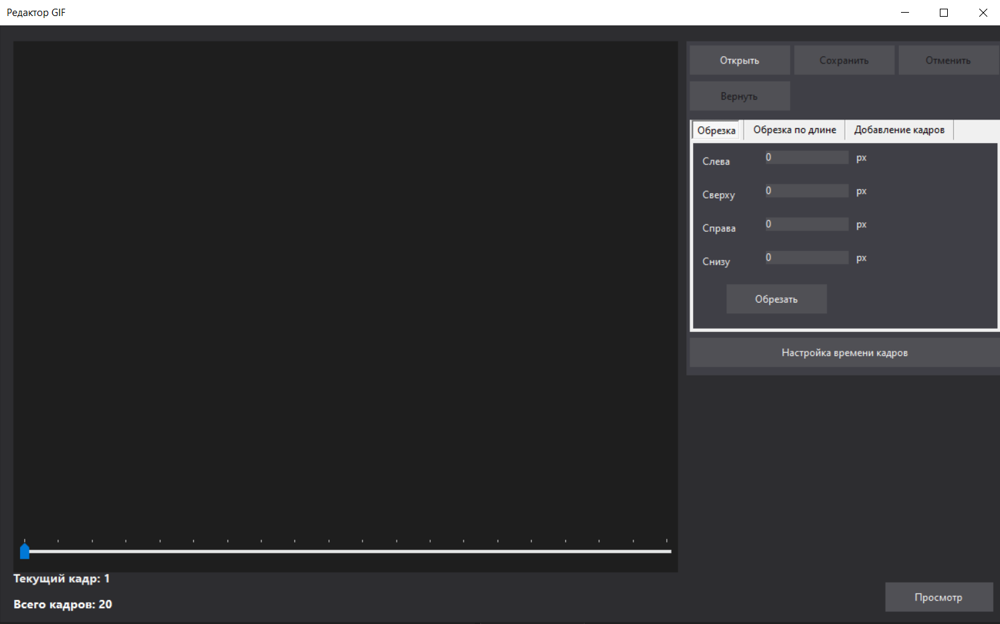
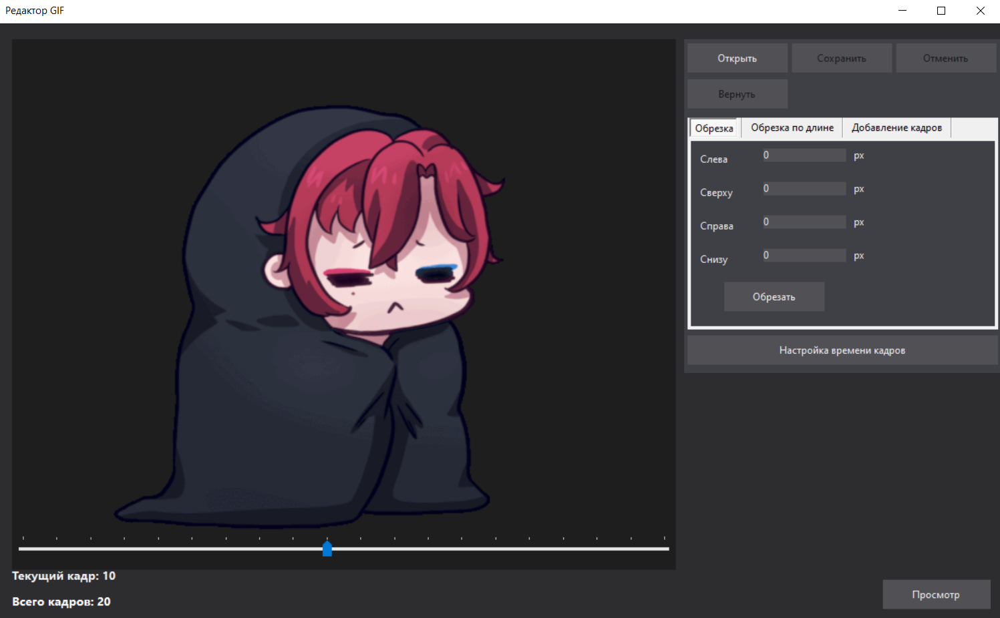
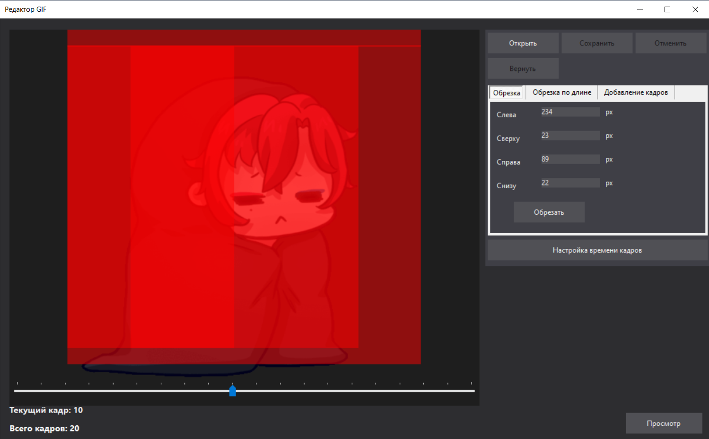
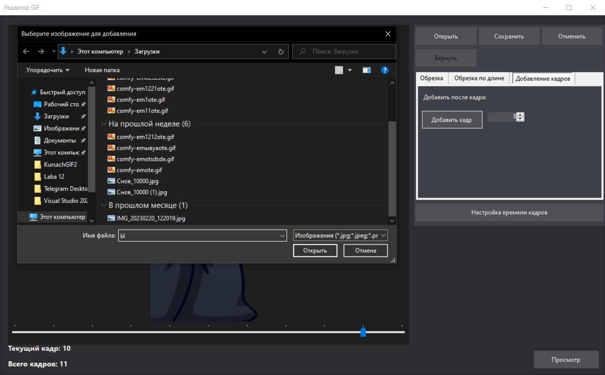
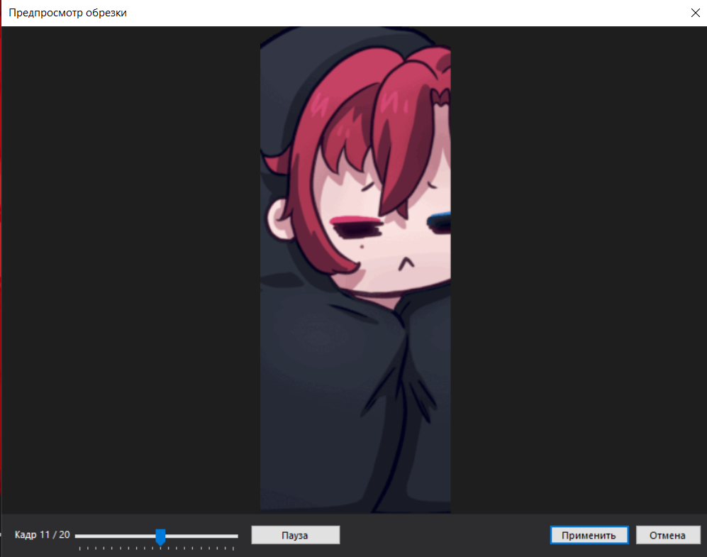
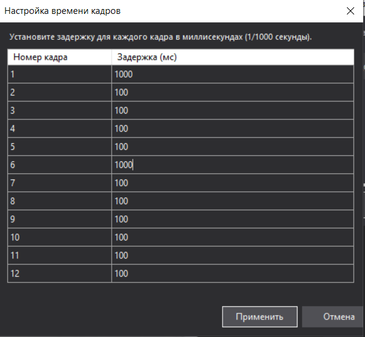
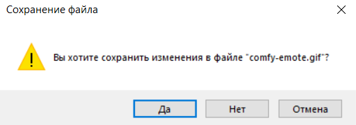

OpenGifEditor — Редактор GIF-анимаций
OpenGifEditor — это мощное и интуитивно понятное Windows-приложение на языке C#, предназначенное для покадрового редактирования GIF-файлов. Приложение поддерживает полный цикл обработки: от изменения разрешения до управления временем задержки кадров.
Основные возможности
1. Начало работы и интерфейс
При запуске приложения пользователя встречает современный интерфейс в темной теме. Основное меню позволяет быстро открыть нужный GIF-файл для дальнейшей работы.

Рисунок 1 – Начальный экран приложения
2. Навигация и выбор кадров
После открытия файла анимация разбивается покадрово. Пользователь может перемещаться между фреймами с помощью ползунка. В нижнем левом углу отображается счетчик кадров (текущий и общее количество).

Рисунок 2 – Окно программы после открытия файла
3. Инструментарий редактирования
Обрезка разрешения (Crop)
Инструмент позволяет обрезать анимацию со всех сторон.
Визуальный контроль: Удаляемые области подсвечиваются красным цветом.
Прозрачность: Области не наслаиваются друг на друга, позволяя точно видеть границы редактирования.

Рисунок 3 – Редактирование разрешения формата
Обрезка по длине
Функция позволяет удалять лишние кадры, задавая диапазон начала и конца сохраняемых фреймов. Значения можно вводить вручную или устанавливать на основе текущего выбранного кадра.
Добавление кадров
Пользователь может вставлять новые изображения в любое место существующей анимации, выбирая номер кадра, после которого будет произведена вставка.

Рисунок 4 – Добавление нового кадра
4. Система предпросмотра
Перед применением любых изменений открывается окно предпросмотра. Оно позволяет:
Просмотреть результат в динамике (кнопка «Воспроизвести»).
Пролистать результат покадрово.
Подтвердить («Применить») или сбросить («Отмена») внесенные правки.

Рисунок 5 – Окно предпросмотра и взаимодействия с ним
Настройка времени кадров
Приложение позволяет задавать индивидуальную задержку для каждого кадра в миллисекундах (1/1000 сек), что дает полный контроль над скоростью анимации.

Рисунок 6 – Окно настройки времени кадров
6. История действий (Undo/Redo)
В приложении реализована система отмены и возврата действий. Если результат редактирования не удовлетворил пользователя, он может нажать кнопку «Вернуть», чтобы откатиться к предыдущему состоянию.
7. Безопасное сохранение
При попытке выхода из программы без сохранения изменений система выдает предупреждение. Это защищает пользователя от случайной потери работы.

Рисунок 7 – Окно с вопросом сохранения
